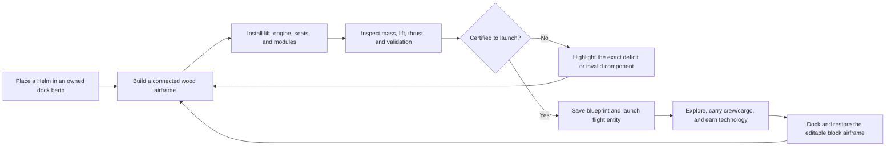

# Player-Built Skycraft Technology Roadmap

> Status: accepted product direction; implementation is planned and gated by a
> bounded Bedrock feasibility spike.
>
> Current Skiff and Skycutter behavior remains implemented and supported. No
> player-built airframe capability described here is shipping yet.

## Product promise

Players begin with enough knowledge and materials to build a small wooden
flying raft. They place ordinary approved wood blocks around a Helm, add lift
and propulsion components, inspect the design, and launch it from a dockyard.
Exploration then unlocks larger construction limits, stronger engines, new lift
technologies, more crew capacity, and specialized modules.

The system should deliver three connected fantasies:

1. **I built the craft.** The docked airframe is the player's actual connected
   block construction, not a menu-selected hull.
2. **Engineering choices matter.** Mass, lift, thrust, handling, cargo, armor,
   and module placement create useful tradeoffs.
3. **Technology expands possibility.** Progression permits larger and more
   specialized craft instead of merely replacing one prebuilt entity with
   another.

Players who prefer engineering to freeform design may buy or earn reference
blueprints from an in-game Dockmaster catalog. Those craft use the same blocks,
mass, lift, technology, ownership, damage, and recovery rules as custom
airframes. They are editable starting points, not superior exceptions.

The target is a bounded, dependable Minecraft mechanic. It is not a promise of
unlimited block counts, block-perfect moving collision, free walking on a
moving deck, or arbitrary redstone machines in flight.

## Core player loop



Launch must never consume, clear, or transform a build until validation and
blueprint persistence both succeed.

## Bedrock implementation boundary

The docked construction is the authoritative exact blueprint. The moving craft
is a separate persistent flight entity generated from that blueprint.

This division uses Bedrock's strengths:

- normal Minecraft block placement for construction;
- deterministic Script API block inspection and persistence;
- stable rideable entity flight and fixed seats through
  [`minecraft:input_air_controlled`](https://learn.microsoft.com/en-us/minecraft/creator/reference/content/entityreference/examples/entitycomponents/minecraftcomponent_input_air_controlled?view=minecraft-bedrock-stable)
  and
  [rideable entity components](https://learn.microsoft.com/en-us/minecraft/creator/documents/entitycomponentsguide?view=minecraft-bedrock-stable);
- entity health, ownership, and server-authoritative controls; and
- [`StructureManager`](https://learn.microsoft.com/en-us/minecraft/creator/scriptapi/minecraft/server/structuremanager?view=minecraft-bedrock-stable)
  capture/placement as an optional reconstruction optimization.

The stable APIs do not document a general mechanism that attaches an arbitrary
captured block volume to an entity with continuously rotating, block-perfect
collision. The first implementation must therefore prove a bounded visual
representation before promising that every placed block appears exactly in
flight.

### Representation decision gate

Test these approaches in order:

1. **Bounded voxel proxy, preferred.** Represent each approved blueprint cell
   in a limited flight renderer attached to one authoritative entity.
2. **Authored modular proxy, fallback.** Classify the blueprint by dimensions,
   materials, and installed components, then select a close modular entity
   model while retaining the exact docked blueprint.
3. **Static route transition, accessibility fallback.** Preserve the exact
   block craft at docks and use a controlled travel transition if target
   devices cannot render a safe moving proxy.

Do not use repeated whole-structure placement as per-tick flight. It risks
flicker, overlap deletion, block-entity loss, chunk problems, and unacceptable
server cost.

## Construction contract

### Dock berth

Every player-built craft begins inside a registered dock berth:

- the berth has a stable ID, owner, origin, orientation, and bounded volume;
- the build must contain exactly one Helm;
- the Helm-connected build must contain exactly one Ship Core;
- the Helm is the scan origin and ownership/interaction authority;
- the scan visits six-directionally connected blocks in a stable sorted order;
- blocks outside the berth are never included;
- disconnected decorations are reported but never silently consumed;
- launch is refused while the berth destination is obstructed; and
- editing is locked during launch, flight, docking, and recovery transactions.

The first berth is at the starter dock. Later technology may unlock larger
berths or shared guild berths, but never an unbounded open-world scan.

### Initial block allow-list

The feasibility build starts with predictable blocks:

- vanilla logs and stripped logs;
- planks;
- wooden slabs and stairs;
- fences and fence gates;
- trapdoors;
- approved wool or canvas blocks;
- Sky Knights Helm, Ship Core, lift, engine, seat, cargo, and utility
  components.

Initially exclude:

- fluids, portals, fire, falling blocks, and gravity-affected blocks;
- pistons and redstone machinery;
- arbitrary containers or block entities;
- beds and respawn anchors;
- explosives;
- blocks with unverified permutation round trips; and
- blocks whose collision or visual proxy is unsupported.

The allow-list expands only after serialization, reconstruction, visual, and
performance tests pass for the new block family.

### Canonical blueprint

The scanner produces one canonical, versioned blueprint containing:

- airship ID and blueprint revision;
- owner and permitted crew;
- dock berth and orientation;
- relative block coordinates;
- block type IDs and approved permutation state;
- placed functional components and their relative positions;
- deterministic mass/stat calculation version;
- computed dimensions, block count, mass, lift, thrust, control, hull, seats,
  cargo reserve, and hardpoints; and
- validation findings.

Sort coordinates and component records explicitly. The same build must
serialize byte-for-byte equivalently regardless of reload or scan timing.

## Engineering model

Block count is the player-visible size limit. Mass is the balancing system.
Technology certifications raise both, subject to renderer and target-device
budgets.

### Core quantities

Persist integer subunits. One displayed mass/lift unit equals two persisted
subunits, allowing half-unit design values without floating-point state.

```text
dryMassSubunits =
  structuralBlockMassSubunits
  + componentMassSubunits
  + armorMassSubunits

departureMassSubunits =
  dryMassSubunits
  + reservedCrewMassSubunits
  + reservedCargoMassSubunits

requiredLiftSubunits =
  ceil(departureMassSubunits × 115 / 100)

liftReserveSubunits =
  availableLiftSubunits - requiredLiftSubunits

flightAllowed =
  blockCount <= certifiedBlockCap
  and departureMassSubunits <= certifiedMassCapSubunits
  and liftReserveSubunits >= 0
  and all required components are valid
```

Start the safety factor at `115%`. Balance changes may tune data values, but
the formula version must be stored with the blueprint so migrations are
explicit. All division uses a documented integer ceiling operation.

### Handling bands

| Lift reserve             | Behavior                                                   |
| ------------------------ | ---------------------------------------------------------- |
| Below `0%`               | Launch refused; report the missing lift                    |
| `0–15%` of required lift | Heavy handling, weak climb, long braking                   |
| `16–40%`                 | Normal handling target                                     |
| More than `40%`          | Agile, but capped so tiny over-engined builds are not best |

Thrust controls forward speed and acceleration. Lift controls launch mass,
climb, and altitude stability. Control components govern turning, braking, and
drift. This separation lets a large dirigible carry more without automatically
being faster than a compact cutter.

Engine contribution is directional relative to the Helm:

```text
availableLift =
  passiveLift
  + sum(downwardEngineOutput)
  + compactLiftCellOutput

forwardThrust =
  sum(aftFacingEngineOutput)

brakingThrust =
  sum(forwardFacingEngineOutput)

lateralControl =
  rudderControl
  + sum(sideFacingEngineOutput)
```

Use discrete certified orientations rather than continuous physics. A downward
engine produces lift, an aft-facing engine produces forward motion, a
forward-facing engine improves braking/reverse authority, and side-facing
engines improve yaw/strafing control. One engine cannot contribute its full
rating to every axis.

### Provisional mass values

These values are prototype inputs, not shipping balance:

| Construction element     | Persisted mass subunits |
| ------------------------ | ----------------------: |
| Slab, stair, fence       |                     `1` |
| Plank                    |                     `2` |
| Log or stripped log      |                     `3` |
| Canvas/balloon cell      |                     `1` |
| Braced structural block  |                     `3` |
| Cargo rack               |                     `4` |
| Basic functional module  |                   `4–8` |
| Engine or compact lift   |                  `8–20` |
| Armored structural block |                  `6–10` |

For the MVP, cargo racks reserve a fixed amount of lift according to their
capacity. Do not create a large item-by-item weight database until abstract
cargo reserve has been playtested.

### Overload behavior

- A craft that is overloaded at the dock cannot launch.
- Cargo acquired in flight first reduces climb and speed.
- Severe overload triggers warnings and controlled descent toward the last safe
  dock or recoverable platform, not an immediate void drop.
- Emergency lift can arrest one controlled descent but does not provide free
  permanent capacity.
- The recovery path never duplicates cargo.

## Required components

### Helm

Exactly one Helm is required. It provides:

- craft naming and ownership;
- scan, inspection, launch, dock, and recovery actions;
- the controlling pilot seat;
- crew and builder permissions;
- technology/certification status; and
- readable validation diagnostics.

Higher Helm tiers expand the certified berth, block cap, mass cap, engine
count, seat class, and hardpoint budget. They do not create lift by themselves.

### Ship Core

The existing Ship Core becomes the certification anchor joining the Helm to
the persistent airship ID. It prevents copied Helms or abandoned dock blocks
from duplicating a registered craft.

Exactly one Ship Core must be reachable from the Helm scan. A new unbound Core
may be placed only while an owned berth is in its docked editing state. First
certification atomically binds it to the immutable airship ID. A registered Core
cannot be normally broken, copied, or moved; an explicit owner-authorized
dismantle transaction invalidates the airship record before returning reusable
materials.

### Lift systems

| Lift family            | Role                                            | Tradeoff                                                 |
| ---------------------- | ----------------------------------------------- | -------------------------------------------------------- |
| Starter lift sail      | Tutorial lift paired with the starter thruster  | Low mass cap and range                                   |
| Engine lift assist     | Small lift contribution from powered propulsion | More engines add their own mass and face count limits    |
| Canvas airbag          | Early high-volume dirigible lift                | Bulky, slow, exposed, and fire/projectile vulnerable     |
| Reinforced gas cell    | Safer dirigible lift                            | More expensive and heavier than canvas                   |
| Aether Lift Cell       | Compact expedition lift                         | Rare materials and limited availability                  |
| Aether Core levitation | Endgame high-density lift and stabilization     | Relic-gated, costly, and never needed for basic recovery |

The starter engine may combine lift and thrust so the first raft remains easy
to understand. From the next tier onward, propulsion contributes only modest
lift; dedicated sails, airbags, or lift cells carry most mass.

### Propulsion

| Propulsion family   | Role                                        | Tradeoff                                        |
| ------------------- | ------------------------------------------- | ----------------------------------------------- |
| Coal Thruster       | Starter raft thrust and base lift           | Short range, weak climb, low certified mass     |
| Aether Engine       | Reliable cutter/crew-craft propulsion       | Needs Ember progression                         |
| Frostfire Engine    | High acceleration and cold-biome resilience | Heavy, advanced, and poor for cheap cargo       |
| Dirigible Propeller | Efficient sustained thrust for balloons     | Slow acceleration and broad turning radius      |
| Aether Core Drive   | Endgame multi-engine power                  | Relic-gated and limited by master certification |

Multiple engines are allowed only within the Helm's engine-count certification.
Additional engines improve thrust, redundancy, and a small amount of lift, but
also add mass, cost, damage exposure, and diminishing-return heat/power
penalties.

Engine components must expose a stable placement direction. The Helm defines
the craft's forward direction, and the scanner classifies every engine as
downward, aft, forward, or lateral. Launch diagnostics should report problems
such as “enough lift, no forward thrust” or “high speed, insufficient braking”
instead of a generic invalid-design message.

Routine consumable fuel is deferred until safe refueling and mid-void recovery
are proven. Early engines should not strand a player merely because a timer
expired. Coal, Aether Charges, or other fuel may later power boosts, emergency
systems, or reduced-cost travel without making mandatory recovery random.

### Steering and stability

- a Basic Helm supplies minimum starter control;
- rudders improve yaw and braking;
- fins improve high-speed stability;
- stabilizers reduce drift and overload penalties;
- navigator modules improve range/recovery information rather than raw lift;
- large and multi-engine craft require a steering component; and
- dirigibles trade turn rate and acceleration for lift efficiency.

### Structure, armor, and damage

Wood blocks define appearance and contribute to a ship-level hull pool. Braced
and armored components improve hull efficiency but add mass.

The MVP uses ship-level health plus subsystem damage. It does not delete random
player blocks during flight. Damage is reconciled to a clear repair bill or
damaged-component state at the dock. Per-block breakage is a later feature only
if it cannot corrupt or duplicate the canonical blueprint.

### Utility and hardpoints

| Module family | Examples                                      | Constraint                                 |
| ------------- | --------------------------------------------- | ------------------------------------------ |
| Crew          | passenger seat, gunner seat, mechanic station | Fixed authored in-flight seat classes      |
| Cargo         | cargo rack, expanded cargo rack               | Reserves lift and follows cargo-loss rules |
| Navigation    | compass table, route finder, recall beacon    | Does not bypass island progression         |
| Repair/safety | repair station, emergency airbag, parachute   | Consumes mass and hardpoint budget         |
| Combat        | cannon mount, shield projector                | Server-authoritative and permission-gated  |
| Docking       | anchor, mooring winch                         | Required for larger/shared berths          |

Hardpoint limits force specialization. A craft should not simultaneously
maximize cargo, armor, weapons, shields, speed, and emergency systems.

Cargo is excluded from `0.4.0`. Before the Ember cutter enables cargo, one
authoritative storage design must specify the docked/flight ownership boundary,
transfer transaction, reserved mass, crash loss, reconstruction behavior,
expanded-capacity downgrade rule, and forced-shutdown recovery. A docked
container and flight inventory must never both be authoritative.

## Airbag and dirigible branch

Airbags are lift modules, not simulated gas fluids.

### First implementation

- A Balloon Loom unlocks standardized small and large Airbag component blocks.
- An Airbag must connect to the Helm graph through approved rigging or frame
  blocks.
- Each Airbag has fixed mass, lift, health, and clearance requirements.
- Installed Airbag count selects a tested envelope visual on the flight proxy.
- The airframe remains wood-built and exact at the dock.

### Later envelope construction

If the bounded voxel renderer succeeds, permit approved canvas blocks around an
Airbag Frame:

- scan a connected envelope zone separately from the hull;
- validate minimum fabric and attachment points;
- calculate lift from certified envelope volume/cell count;
- preserve standardized damage and leakage behavior; and
- reject unsupported hollow-volume or free-floating canvas exploits.

### Dirigible identity

Dirigibles should offer:

- the best low-cost lift and cargo capacity;
- more seats and support modules;
- slow acceleration and broad turns;
- lower compact-combat agility;
- large visual and target profiles;
- vulnerable lift envelopes;
- strong engine-off glide/controlled descent; and
- useful hybrid builds with compact Aether emergency lift.

Airbags are a branch, not a mandatory replacement for compact Aether craft.

## Technology tree

Technology is world-shared in cooperative play because island rewards and
structures are shared. Individual ships retain owners and crew permissions.
Every required unlock comes from guaranteed progression, not random drops.

### Certification tiers

All dimensions and limits below are candidate maximums. The feasibility and
performance gates may reduce them.

| Certification       | Travel tier | Candidate berth | Block cap | Display mass cap | Engines | Seats | Hardpoints |
| ------------------- | ----------: | --------------- | --------: | ---------------: | ------: | ----: | ---------: |
| Apprentice Raft     |           1 | `7×7×5`         |        24 |               32 |       1 |     2 |          0 |
| Ember Skiff         |           2 | `11×9×7`        |        56 |               72 |       2 |     4 |          2 |
| Specialist Airframe |           3 | `15×11×9`       |        96 |              144 |       3 |     6 |          3 |
| Expedition Skycraft |           3 | `19×13×11`      |       160 |              280 |       4 |     8 |          4 |
| Masterwork Skycraft |           3 | `23×15×13`      |       240 |              480 |       4 |     8 |          5 |

Block cap, mass cap, blueprint byte cap, component cap, and nearby active-craft
cap are independent safety limits. Research never overrides a measured engine
or device-performance limit. Persisted mass caps equal the displayed mass cap
multiplied by two subunits.

Travel tiers remain compatible with the island registry:

- Apprentice Raft reaches tier-1 Ember, Sunspire, and Verdant destinations;
- Ember Skiff reaches tier-2 Frostspire;
- either complete `2A` Balloonwright or `2B` Frostwright specialization grants
  Specialist Airframe certification and tier-3 Glacier/Ashfall reach;
- the two Relic Shards earned there grant Expedition certification and Sanctum
  access; and
- Masterwork is post-Sanctum specialization, not a prerequisite for completing
  the current progression chain.

### Unlock sequence

| Stage | Guaranteed source                             | Unlocks                                                              | Player choice                                     |
| ----- | --------------------------------------------- | -------------------------------------------------------------------- | ------------------------------------------------- |
| `0`   | Starter wood, stone, coal, and iron           | Dock scan, Basic Helm, Ship Core, starter lift sail, Coal Thruster   | Build a 1–2-seat wooden raft                      |
| `1`   | Ember Aether Crystal, iron, and redstone      | Ember certification, Aether Engine, braced wood, cargo and rudder    | Faster personal cutter or small crew craft        |
| `2A`  | Sunspire gold/copper plus Verdant fabric/wood | Balloon Loom, Airbags, propeller, expanded berth                     | Large, slow cargo/passenger dirigible             |
| `2B`  | Frostspire Froststeel and diamond             | Frostfire Engine, Aether Lift Cell, armor, stabilizer                | Compact, agile expedition/combat craft            |
| `3`   | Glacier and Ashfall Relic Shards              | Expedition certification, reinforced cells, advanced hardpoints      | Hybrid or specialized long-range craft            |
| `4`   | Aether Sanctum Aether Core                    | Masterwork certification, Core Drive, cosmetic and sidegrade mastery | Endgame specialization, not mandatory basic reach |

Stages `2A` and `2B` are parallel specializations. A group may build a
dirigible, a compact cutter, or a hybrid after earning both branches.

## Blueprint catalog and reference craft

Reference blueprints serve three purposes:

1. give players a ready-designed option without removing the building fantasy;
2. teach valid construction patterns and component orientation; and
3. provide canonical fixtures for automated, BDS, migration, balance, and
   performance tests.

### Blueprint rules

- A blueprint stores only approved block/component geometry and metadata. It
  never stores cargo, loose inventory, owner state, or duplicated unique
  rewards.
- A player must hold the required technology certification before constructing
  or purchasing a blueprint craft.
- The Dockmaster may offer:
  - a **plan**, which shows a material list and build guidance;
  - a **construction order**, which atomically consumes the full material list
    plus an in-game labor fee and places the craft in a clear berth; or
  - a **kit**, which packages its functional components but leaves the wooden
    hull for the player to build.
- Purchases use in-game resources/currency. Real-money sales or Marketplace
  monetization are outside this roadmap.
- A purchased design receives no hidden stat bonus and passes the same launch
  validator as a custom design.
- Once materialized, a reference craft can be edited, rescanned, renamed, and
  saved as the owner's personal blueprint.
- Materializing a second/new airframe from a saved or reference blueprint
  always requires its blocks, components, and a newly registered Ship Core.
  Normal docking restores the already registered craft and its reserved Core at
  no new material cost. Recovery may charge its documented repair bill, but it
  does not create or replace the registered Core.
- Technology plans may be world-shared in cooperative play; constructed craft
  remain individually or guild owned.

### Proposed reference fleet

Names are working design labels, not shipped identifiers.

| Blueprint             | Tier/branch     | Teaching and gameplay role                                                               |
| --------------------- | --------------- | ---------------------------------------------------------------------------------------- |
| Dockyard Minnow       | Apprentice Raft | Minimal wood raft with a Basic Helm, one lift sail, one aft Coal Thruster, and one pilot |
| Ember Dart            | Ember Skiff     | Compact cutter demonstrating separate downward lift and aft thrust engines               |
| Wayfarer Cargo Punt   | Ember utility   | Wider stable deck, cargo reserve, rudder, and lower speed                                |
| Cloudwhale Dirigible  | Balloonwright   | Image-inspired wooden gondola suspended beneath a large canvas envelope and propeller    |
| Aether Disc           | Frostwright     | UFO-like radial craft with multiple downward lift engines and aft propulsion             |
| Frostwing Interceptor | Frostwright     | Light armored high-thrust craft with minimal cargo and combat hardpoints                 |
| Relic Surveyor        | Expedition      | Redundant hybrid lift, navigation, emergency systems, and crew stations                  |
| Sanctum Grand Airship | Masterwork      | Large late-game showcase and performance ceiling, not a mandatory progression vehicle    |

The attached dirigible concept is useful for the Cloudwhale pattern: a strongly
separated upper lift envelope, wooden lower hull/gondola, visible suspension
rigging, lateral deck access, and aft propulsion. The implementation should use
that general engineering silhouette without treating a third-party reference
image as redistributable project art.

The Aether Disc validates a different engineering grammar:

- a compact circular/radial wooden or reinforced hull;
- three or four downward engines supplying lift;
- one or two aft engines supplying propulsion;
- optional forward/side engines for braking and control;
- high power/module cost and low passive glide compared with a dirigible; and
- strong agility and compactness once Frostwright technology is earned.

### Player-authored blueprints

After a successful dock scan, an owner may save the canonical design as a
personal blueprint:

- blueprint revisions are immutable; editing creates a new revision;
- saving a design never saves cargo or damage state;
- construction previews must not place permanent blocks;
- sharing/export is deferred until ownership, attribution, size, and content
  validation are complete; and
- a blueprint referring to unavailable or renamed content fails closed with a
  readable missing-component report.

### Existing component continuity

Preserve shipped identities:

- `ship_core` becomes the airship registration/certification anchor;
- `thruster_module` becomes or crafts the Coal Thruster;
- `canvas_bundle` supplies starter lift and Airbag construction;
- `aether_engine` and `frostfire_engine` remain engine tiers;
- hull items become bracing/armor component recipes;
- cargo and navigator modules become placed or dock-installed utilities; and
- cannon and shield modules remain mutually constrained combat hardpoints.

Do not rename shipped identifiers. Add new identifiers only when their assets,
recipes, registries, localization, progression sources, and migrations ship.

## Progression and economy rules

- Starter craft materials must be guaranteed and renewable. Before activation,
  recalculate the starter island resource budget because its current two trees
  were balanced for prebuilt Skiff recipes, not a placed wooden hull.
- Increasing certification requires both knowledge and materials; a rare item
  alone does not silently upgrade every craft.
- Building blocks remain normal Minecraft inventory items until launch.
- Failed validation consumes nothing.
- Launch and docking are atomic inventory/world transactions.
- Better technology expands viable designs; it should not make lower-tech
  branches useless.
- Large engines add mass and cost, so installing the maximum count is not
  automatically optimal.
- Dirigibles offer economical capacity. Aether craft offer compact speed and
  agility. Hybrid craft exchange peak performance for resilience.
- Mandatory progression never depends on cargo surviving a crash.
- A replacement Apprentice Raft remains obtainable after any loss.

## Flight and crew roles

### Flight profiles

| Profile    | Strength                          | Weakness                         |
| ---------- | --------------------------------- | -------------------------------- |
| Raft       | Cheap, recoverable, readable      | Short range and low capacity     |
| Cutter     | Fast, agile, compact              | Low cargo and limited redundancy |
| Dirigible  | High lift, cargo, passengers      | Slow, wide, vulnerable envelope  |
| Expedition | Range, safety, module flexibility | Expensive and heavier            |
| Combat     | Agility, armor, weapon hardpoints | Cargo and utility sacrifices     |
| Hybrid     | Redundant lift and flexible roles | Lower peak efficiency            |

### Multiplayer permissions

| Role      | Default authority                                             |
| --------- | ------------------------------------------------------------- |
| Owner     | Rename, edit, certify, launch, dock, recover, and manage crew |
| Builder   | Place/break inside the dock berth while editing is unlocked   |
| Pilot     | Control the active craft and initiate permitted docking       |
| Navigator | Select known destinations and use navigation utilities        |
| Gunner    | Use assigned combat hardpoints                                |
| Mechanic  | Use repair, emergency, and subsystem controls                 |
| Passenger | Occupy an assigned seat only                                  |

One active pilot is authoritative. Permissions are validated server-side on
every consequential action. Guests cannot launch, alter cargo policy, or
replace modules by default.

MVP passengers remain in fixed authored entity seats during flight. Free
walking on a moving block-perfect deck is outside the stable MVP promise.

## Persistence and transaction safety

Each registered airship uses an explicit state machine:

```text
docked
  → validating
  → launching
  → in_flight
  → docking
  → docked

Any interrupted transition
  → recovery_required
  → one authoritative docked or in-flight state
```

Persist:

- schema and blueprint versions;
- immutable airship ID;
- owner and crew policy;
- canonical blueprint and computed-stat version;
- dock berth;
- transaction state and revision;
- flight entity reference and last safe transform;
- health, subsystem damage, emergency state, and fuel/boost state;
- controlled cargo reference; and
- last safe dock/recovery cost.

Never store an unbounded fleet in one growing dynamic-property document.
Measure serialized byte size and split/index records by airship ID when the
prototype establishes the persistence budget.

### Atomic launch

1. Lock berth editing.
2. Scan and validate.
3. Persist the new canonical blueprint and `launching` revision.
4. Safely store/clear the dock construction.
5. Spawn and initialize the flight entity.
6. Persist `in_flight`.
7. Release the transaction lock.

### Atomic docking

1. Reserve and validate a clear permitted berth.
2. Persist `docking`, flight state, and cargo state.
3. Safely dismount crew.
4. Restore and verify the canonical blueprint.
5. Remove the flight entity only after restoration succeeds.
6. Persist `docked`.
7. Unlock editing.

### Recovery invariants

- A crash or restart never creates both a docked and flying copy.
- Blueprint and non-cargo progression components are recoverable.
- Cargo follows the existing no-duplication/loss-risk policy.
- Missing or unloaded entities resolve through the recorded transaction state.
- Reconstruction never stamps over unrelated/player blocks.
- Existing islands and their player-modified protection are unaffected.

## Compatibility with current ships

The current Skiff and Skycutter remain valid legacy/prototype craft:

- keep their identifiers, ownership, persistence, and recovery behavior;
- do not silently convert existing saved ships;
- map their capabilities to equivalent travel tiers during progression;
- retain them as developer reference craft and optional Dockmaster loaners;
- later offer an explicit owner-approved retrofit into a default custom
  blueprint only after migration and cargo tests pass.

The first custom-airframe schema must coexist with ship schema 3. A later
migration may introduce a fleet/airframe repository, but it cannot invalidate
an existing player's only recoverable ship.

## Delivery roadmap

### `0.4.0` — Player-built raft feasibility

Scope:

- one fixed starter berth;
- 20–40 approved wooden blocks;
- Basic Helm, Ship Core, one lift sail, and one Coal Thruster;
- deterministic connectivity scan and canonical blueprint;
- mass/lift validation with exact error messages;
- one pilot entity;
- Dockyard Minnow reference fixture;
- downward-versus-aft engine orientation validation;
- bounded voxel-proxy versus authored-proxy comparison;
- exact dock reconstruction;
- reload/restart recovery at every transaction state; and
- no cargo, combat, multiple docks, or advanced technology.

Exit gate:

- construction, launch, flight, docking, and recovery succeed without block
  loss or duplication;
- the selected visual strategy is readable and performant;
- a hard renderer-safe block cap is recorded;
- the current Skiff/Skycutter still load and recover;
- host, BDS, keyboard, controller, touch, and two-player evidence is recorded.

If exact bounded voxel representation fails, stop and select the documented
proxy fallback before implementing the wider technology tree.

### `0.4.1` — Apprentice Raft MVP

- survival recipes and guaranteed starter resource rebalance;
- 24-block/32-mass certification or lower measured cap;
- ownership, two fixed seats, simple hull health, and Repair Kit recovery;
- Dockmaster/Helm inspection UX;
- Dockmaster plan, kit, and construction-order transaction prototype;
- personal blueprint save and new-airframe materialization without cargo or
  material duplication;
- route to Ember without developer commands;
- progression closure and old-world migration.

### `0.5.0` — Ember custom cutter

- 56-block certification or measured equivalent;
- Aether Engine, braced structure, rudder, light cargo, crew permissions;
- Ember Dart and Wayfarer Cargo Punt reference blueprints;
- improved range and Frostspire access;
- explicit optional retrofit path for legacy Skiff/Skycutter owners.

### `0.6.0` — Lift specialization

- activate only alongside complete source content;
- Balloonwright branch from Sunspire/Verdant materials;
- Frostwright branch from Frostspire materials;
- Airbags/propeller versus compact Lift Cell/Frostfire profiles;
- Cloudwhale Dirigible and Aether Disc reference blueprints;
- 96-block target only if performance evidence permits;
- cargo reserve, subsystem damage, emergency descent, and multiple craft roles.

### `0.7.0` — Expedition skycraft

- Relic-gated certification and 160-block target subject to profiling;
- expanded crew, advanced navigation, repair, combat, and safety hardpoints;
- hybrid lift systems and redundant engines;
- shared docks and stronger multiplayer permissions.

### `0.8.0+` — Masterwork and content completion

- Aether Core master certification;
- target up to 240 blocks only after low-end and four-player scale gates;
- cosmetic mastery and sidegrades instead of mandatory linear power;
- final balance, accessibility, device, migration, packaging, and recovery
  matrix.

Version numbers are planning labels, not release commitments. A failed
feasibility gate changes later scope rather than forcing unsupported behavior.

## Validation strategy

### Host contracts

- sorted connectivity scanning and coordinate normalization;
- allowed/forbidden blocks and permutation serialization;
- duplicate/missing Helm and disconnected component rejection;
- duplicate/missing Ship Core rejection and registered-Core dismantle rules;
- block, dimension, mass, engine, seat, hardpoint, and byte caps;
- lift/thrust/handling calculations and formula migrations;
- every technology unlock and guaranteed resource source;
- directional engine aggregation and insufficient-axis diagnostics;
- blueprint plan/kit/order material accounting and copy protection;
- blueprint serialization, schema migration, and transaction recovery;
- no launch-side material consumption on validation failure;
- no cargo/component duplication on failure;
- legacy ship capability mapping; and
- bounded worst-case scan cost.

### BDS/GameTest

- build representative valid and invalid berth layouts;
- run scan/launch/dock with real blocks;
- restart at `validating`, `launching`, `in_flight`, and `docking`;
- verify exact approved permutation reconstruction;
- verify duplicate/missing Core rejection and Core registration lifecycle;
- verify no duplicate docked/flight state;
- exercise owner, builder, pilot, guest, and two-player denial paths;
- test missing/unloaded flight entities and obstructed berths;
- record renderer/entity counts and server tick behavior at every cap; and
- add SimulatedPlayer mounting/interaction only for the server-side behavior it
  can actually prove.

### Hands-on Minecraft

- building and diagnostic clarity in Survival;
- exact visual fidelity of the player's design;
- reference-blueprint purchase, construction, editing, and personal save flow;
- keyboard, controller, and touch Helm/flight UX;
- pilot/passenger mounting and safe dismount;
- turns, ascent, descent, chunk boundaries, and collision feel;
- docking alignment and obstruction feedback;
- reload, save/quit, host migration, and reconnect;
- two-to-four-player permissions and simultaneous nearby craft;
- target low-end device performance;
- repeated launch/dock/destruction audit for block, module, and cargo loss or
  duplication; and
- fresh-world time to first raft target of 30–45 minutes.

## Performance budgets to establish

Do not raise certification caps until measurements establish:

- scan time for minimum, typical, and maximum blueprints;
- blueprint serialized bytes;
- launch/dock block operation time;
- client frame behavior during rotation and chunk travel;
- server tick cost for 1, 2, and 4 nearby active craft;
- flight proxy entity/bone count;
- multiplayer rider synchronization;
- recovery cost after forced shutdown; and
- world size growth from saved blueprints.

The lowest supported device and four-player host determine the shipping cap,
not a high-end development PC.

## Open design decisions

The `0.4.0` spike must resolve:

1. exact bounded voxel proxy versus authored modular proxy;
2. measured block, component, and blueprint byte caps;
3. whether structure snapshots preserve every approved permutation reliably;
4. abstract cargo versus controlled physical containers;
5. how many fixed seat layouts the renderer/entity system can support;
6. whether craft may rotate between dock orientation and flight without losing
   recognizable shape;
7. whether starter lift is a visible sail, compact float cell, or both; and
8. whether optional fuel improves play or only adds soft-lock risk.
9. whether reference construction uses a ghost outline, layered guided build,
   or atomic Dockmaster placement on every supported input method.

Until those decisions are supported by evidence, documentation must describe
them as planned or provisional.

## Definition of feature complete

Player-built skycraft is complete only when:

- a fresh Survival player builds and launches the first raft without commands;
- the player's exact docked wood construction survives every supported
  launch/dock/reload path;
- invalid designs produce precise, non-destructive guidance;
- the technology tree reaches every required destination without random-only
  resources;
- compact, dirigible, cargo, expedition, and combat builds occupy distinct
  useful roles;
- existing Skiff/Skycutter saves remain recoverable;
- destruction cannot permanently soft-lock progression or duplicate cargo;
- multiplayer ownership and crew roles are predictable;
- target keyboard/controller/touch and device gates pass; and
- every activated component is registered, localized, migration-safe, and
  covered by host, BDS, and hands-on evidence.
